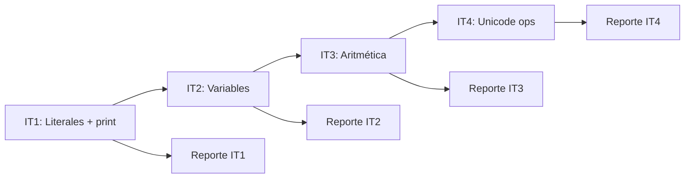

# Plan de Acción — Act 03: Compilador RaraLang → MIPS

## Contexto

El proyecto es un compilador que traduce programas escritos en **RaraLang** a código ensamblador **MIPS** para el simulador **QtSPIM**. Está estructurado en **iteraciones incrementales**, donde cada una añade features al lenguaje. El compilador usa **Python + ANTLR4**.

### Estado actual del proyecto

| Archivo | Estado |
|---|---|
| `antlr/RaraLang.g4` | ✅ Iteración 1 base — solo `print` con `INT`, `BASED_NUMBER`, `STRING` |
| `MIPSListener.py` | ❌ Vacío — solo `class MIPSListener(RaraLangListener): pass` |
| `main.py` | ✅ Listo — orquesta el compilador |
| `tests/01_int_literal.rara` | ✅ Existe |

> [!CAUTION]
> El `MIPSListener.py` está completamente vacío. Todo el trabajo de compilación está por hacer desde la Iteración 1.

---

## Entregables requeridos (Rúbrica)

- **Fecha de entrega:** 1 de junio (Grupo 501)
- `MIPSListener.py` implementado
- `main.py` (si fue modificado)
- Carpeta con programas `.rara` de prueba (mínimo 3 por iteración completada)
- Reporte de iteraciones con auditoría y reflexión
- Archivos `.asm` generados (al menos 1 por iteración)

---

## Pesos de la rúbrica

| Criterio | Peso |
|---|---|
| Escalera de iteraciones | 20% |
| Implementación funcional | 20% |
| Auditoría del modelo | 25% |
| Reflexión escrita | 25% |
| Comprensión del MIPS generado | 10% |

> [!IMPORTANT]
> La **auditoría y reflexión escrita suman 50%** del total. Copiar código del LLM sin revisión crítica resulta en 0 puntos en esas categorías aunque el compilador funcione perfectamente.

---

## Plan de iteraciones

### 🔴 Iteración 1 — Literales y `print` (~30 min)

**Meta:** El compilador genera MIPS para `print` con enteros, números en otras bases y strings.

**Tareas:**
1. **Gramática** (`RaraLang.g4`) — Ya está completa para IT1. No requiere cambios.
2. **Listener** (`MIPSListener.py`) — Implementar:
   - `exitInt` → `li $t0, <valor>` + `syscall 1` (print_int) + `syscall 11` (newline)
   - `exitBased` → parsear `[dígitos:base]` con `int(digits, base)` en Python, luego igual que int
   - `exitString` → declarar `.asciiz` en `.data`, usar `syscall 4` (print_string)
   - Método `output()` que ensambla `.data` + `.text` + `syscall 10` (exit)
3. **Tests** — Crear en `tests/`:
   - `01_int_literal.rara` (ya existe: `print 42`, `print 0`, `print 100`)
   - `02_hex_literal.rara` → `print [FF:16]` y `print 255` (deben imprimir lo mismo)
   - `03_binary_literal.rara` → `print [1010:2]`
   - `04_string_literal.rara` → `print "hola mundo"`
   - `05_multi_print.rara` → varios `print` seguidos
4. **Reporte IT1** — Llenar reflexiones:
   - ¿Cómo guardó el modelo las cadenas en memoria?
   - ¿`[FF:16]` y `255` imprimen lo mismo?
   - ¿Qué pasa con `[29:2]`? (dígito inválido en base 2)

---

### 🟡 Iteración 2 — Variables (~30 min)

**Meta:** El compilador maneja asignación `x <-- 10` y lectura de variables en `print x`.

**Tareas:**
1. **Gramática** — Añadir:
   - Token `ID` (letras/números/guión bajo, empieza con letra)
   - Token `ASSIGN` (`<--`)
   - Regla `stmt`: alternativa `ID ASSIGN expr` (`#assignStmt`)
   - Regla `expr`: alternativa `ID` (`#varExpr`)
2. **Listener** — Implementar:
   - `exitAssignStmt` → reservar `.word 0` en `.data` si es primera vez, `sw` al address
   - `exitVarExpr` → `lw $t0, <varname>`
3. **Tests** — Crear (mínimo 3):
   - `06_assign_print.rara` → asignar e imprimir
   - `07_two_vars.rara` → dos variables, imprimir ambas en orden
   - `08_reassign.rara` → reasignar variable y verificar nuevo valor
   - `09_mips_keyword_var.rara` → variable llamada `add` o `sub` (caso trampa)
4. **Reporte IT2** — Reflexiones sobre almacenamiento en `.data`, doble asignación, variable no inicializada

---

### 🟠 Iteración 3 — Aritmética (~45 min)

**Meta:** El compilador evalúa `+`, `-`, `×`, `÷` con precedencia correcta y paréntesis.

**Tareas:**
1. **Gramática** — Añadir precedencia a `expr`:
   - Paréntesis: `'(' expr ')'`
   - Multiplicación/División: `expr '×' expr` y `expr '÷' expr` (mayor precedencia)
   - Suma/Resta: `expr '+' expr` y `expr '-' expr` (menor precedencia)
2. **Listener** — Stack de registros temporales:
   - `exitMul`, `exitDiv`, `exitAdd`, `exitSub` → pop 2 registros, aplicar operación, push resultado
   - Para `×`: instrucción `mult`, luego `mflo`
   - Para `÷`: instrucción `div`, luego `mflo` (cociente)
3. **Tests** — Crear (mínimo 3):
   - `10_arithmetic_ops.rara` → las 4 operaciones por separado
   - `11_precedence.rara` → `print 2 + 3 × 4` (debe dar 14, no 20)
   - `12_parentheses.rara` → `print (2 + 3) × 4` (debe dar 20)
   - `13_division_remainder.rara` → `print 10 ÷ 3` (qué pasa con el residuo)
4. **Reporte IT3** — Reflexiones sobre precedencia, residuo de división, orden de registros en resta

---

### 🟢 Iteración 4 — Operadores Unicode (~30 min)

**Meta:** El compilador entiende `⊞` (módulo), `⊠` (doble más), `≈` (promedio entero) y `±` (negación unaria).

**Tareas:**
1. **Gramática** — Añadir a `expr`:
   - `expr '⊞' expr` → módulo
   - `expr '⊠' expr` → `2a + b`
   - `expr '≈' expr` → promedio entero (floor)
   - `'±' expr` → negación unaria
2. **Listener** — Implementar:
   - `exitMod` → `div` + `mfhi` (residuo)
   - `exitDoubleAdd` → shift left 1 (`sll`) + `add`
   - `exitAvg` → `add` + `sra` (arithmetic shift right — da floor correcto para negativos)
   - `exitNeg` → `sub $t0, $zero, $t0`
3. **Tests** — Crear (mínimo 3):
   - `14_modulo.rara` → `print 10 ⊞ 3` (esperado: 1)
   - `15_double_plus.rara` → `print 4 ⊠ 5` (esperado: 13)
   - `16_avg.rara` → `print 7 ≈ 3` y caso negativo `print -3 ≈ -1`
   - `17_negate.rara` → `print ±8` y `print ± ±5`
4. **Reporte IT4** — Reflexiones sobre `≈` con negativos, diferencia `⊠` vs multiplicación, doble negación

---

## Estructura de directorios recomendada

```
actividad3/
├── antlr/
│   └── RaraLang.g4          # Gramática (actualizar por iteración)
├── tests/
│   ├── 01_int_literal.rara
│   ├── 02_hex_literal.rara
│   ├── ... (mínimo 3 por iteración)
│   └── *.asm                # Generados por el compilador
├── doc/
│   ├── reporte-it1.md       # Reporte con reflexiones llenadas [CREAR]
│   ├── reporte-it2.md       # [CREAR]
│   ├── reporte-it3.md       # [CREAR]
│   └── reporte-it4.md       # [CREAR]
├── MIPSListener.py          # ❌ Implementar
└── main.py                  # ✅ Listo
```

---

## Orden de trabajo sugerido



**Por cada iteración:**
1. Actualizar la gramática `.g4`
2. Regenerar el parser con ANTLR4
3. Implementar los métodos en `MIPSListener.py`
4. Crear los archivos `.rara` de prueba
5. Correr `python main.py tests/archivo.rara` → genera `.asm`
6. Abrir el `.asm` en QtSPIM y verificar la salida
7. Llenar el reporte con reflexiones críticas

---

## Puntos de atención críticos (para la auditoría)

| Tema | Pregunta a investigar |
|---|---|
| Variables con nombres MIPS reservados | ¿Falla `add <-- 5`? |
| Variable no inicializada | ¿`print x` sin asignar — error o valor basura? |
| División entre cero | ¿El compilador o QtSPIM da error? |
| Precedencia `×` vs `+` | ¿`2 + 3 × 4` da 14 o 20? |
| `≈` con negativos | ¿Floor o truncamiento hacia cero? |
| `$ra` en funciones (IT7) | ¿Las llamadas anidadas corrompen el return address? |

> [!NOTE]
> Estos son exactamente los casos que la rúbrica menciona como "casos borde". Documentar el comportamiento del compilador en cada uno es lo que diferencia una auditoría superficial de una crítica.
